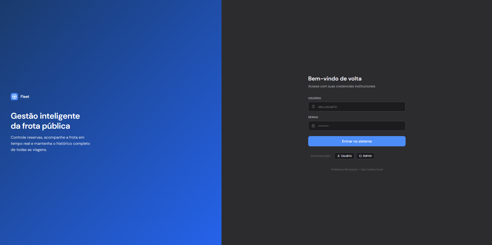

# Fleet - Gestão Inteligente de Frota Pública

<p align="center">
  <a href="https://github.com/Jacksonrs/Sistema-de-Reserva-de-Veiculos-da-Prefeitura">
    
  </a>
  <a href="https://react.dev/">
    
  </a>
  <a href="https://tailwindcss.com/">
    
  </a>
  <a href="https://www.python.org/">
    
  </a>
  <a href="https://www.djangoproject.com/">
    
  </a>
  <a href="https://www.sqlite.org/">
    
  </a>
</p>

---

## 1. Objetivo do sistema

O *Fleet* é uma solução web desenvolvida para apoiar prefeituras e órgãos públicos na gestão da frota municipal e intermunicipal.  
O objetivo principal é centralizar e modernizar o fluxo de informações de *veículos*, *servidores*, *viagens* e *métricas operacionais*. Substituindo os controlos manuais em papel por uma plataforma integrada, o sistema mitiga conflitos de agendamento, ociosidade de frotas e otimiza o planeamento das secretarias municipais (como Saúde, Educação e Infraestrutura).

---

## 2. Principais funcionalidades

### Módulo do Solicitante (Usuário Comum)
- Dashboard Pessoal: Visão geral resumida dos veículos disponíveis no momento e atalhos rápidos.
- Consulta de Frota Ativa: Listagem completa dos veículos da prefeitura com barra de busca por placa/modelo e filtros rápidos por status.
- Formulário de Agendamento: Solicitação intuitiva de veículos informando data, horários de saída/retorno, setor e destino/finalidade da viagem.
- Linha do Tempo (Histórico): Acompanhamento cronológico do status de cada pedido e visualização da quilometragem percorrida.
- Cancelamento de Solicitação: Permite ao utilizador cancelar agendamentos que ainda estejam aguardando análise.

### Módulo de Administração (Gestor da Frota)
- Painel Administrativo: Indicadores chave com o total de reservas pendentes, veículos em uso, unidades em manutenção e atividade recente.
- Fluxo de Auditoria e Aprovação: Central de análise de pedidos com comandos rápidos para aprovar ou recusar solicitações (com inserção de justificativa).
- Controle de Inventário (Frota): controle de veículos para registar placas, modelos, marcas, ano, tipo de combustível, capacidade e alteração manual de status.
- Gestão de Utilizadores: Registo de novos servidores institucionais e controlo de ativação/desativação de contas.
- Métricas Avançadas: Geração automática de relatórios visuais com gráficos de utilização por veículo, quilómetros rodados por mês e ranqueamento por secretaria.

---

## 3. Tecnologias utilizadas

- Frontend: React.js, TypeScript, Vite, Tailwind CSS
- Backend: Python, Django REST Framework
- Banco de Dados: SQLite (pré-configurado)
- Controle de Versão: Git e GitHub
- Metodologia de organização: Kanban
- Biblioteca de Gráficos: Recharts

---

## 4. Como executar o projeto

### Pré-requisitos
Antes de começar, certifique-se de ter as seguintes ferramentas instaladas:
 
- [Git](https://git-scm.com/) (para clonar o repositório)
- [Node.js](https://nodejs.org/) v18 ou superior (para o frontend React/Vite)
- [Python](https://www.python.org/) 3.10 ou superior (para o backend Django)

### 4.1 Clonar o repositório

```bash
git clone https://github.com/Jacksonrs/Sistema-de-Reserva-de-Veiculos-da-Prefeitura 

cd Sistema-de-Reserva-de-Veiculos-da-Prefeitura
```

### 4.2 Configurar o Backend (Django)

Abra um terminal e entre na pasta do backend:
 
```bash
cd backend
```
 
Crie e ative o ambiente virtual do Python:
 
```bash
# No Windows:
python -m venv venv
venv\Scripts\activate
 
# No Linux/Mac:
python3 -m venv venv
source venv/bin/activate
```
 
Instale as dependências:
 
```bash
pip install -r requirements.txt
```

Aplique as migrações para criar as tabelas no banco:
 
```bash
python manage.py migrate
```
 
Crie o primeiro usuário administrador:
 
```bash
python manage.py createsuperuser
```
 
Siga as instruções no terminal para definir o e-mail e a senha do administrador.
 
Suba o servidor:
 
```bash
python manage.py runserver
```
 
- O backend estará rodando em `http://localhost:8000`

---

### 4.3 Configurar o Frontend (React/Vite)
 
Abra um **novo terminal** (mantenha o terminal do backend rodando) e entre na pasta do frontend:
 
```bash
cd frontend
```
 
Instale as dependências:
 
```bash
npm install
```

Suba o servidor do frontend:
 
```bash
npm run dev
```
 
- O frontend estará rodando (geralmente em `http://localhost:5173`). O terminal exibirá o link exato.
 
--- 

## 5. Como Navegar e Testar o Sistema

1. Acesse o sistema em `http://localhost:5173` com o superusuário criado.
2. Cadastre:
   - Alguns veículos para compor a frota inicial.
   - (Opcional) Alguns usuários de teste, caso não queira criá-los pelo frontend.
3. Entenda os perfis de acesso do sistema:
| Usuário (exemplo) | Perfil       | Acesso principal                                                               |
| ----------------- | ------------ | ------------------------------------------------------------------------------ |
| admin             | Gestor/Admin | Acesso total. Gestão de frota, painel de controle e administração de usuários. |
| colaborador1      | Usuário      | Painel padrão. Visualização de veículos disponíveis e realização de reservas.  |

4. Faça login no frontend (`http://localhost:5173`) como:
   - **Usuário comum:** acesse o painel principal, visualize a lista de veículos e crie uma nova reserva.
   - **Gestor/Admin:** acesse a tela de Gestão de Usuários, adicione um novo usuário, altere o status (ativo/inativo) e exclua um registro para testar as validações e os pop-ups de confirmação.

---

## 6. Estrutura de Pastas do Projeto

```
Sistema-de-Reserva-de-Veiculos-da-Prefeitura/
│
├── backend/                          # Aplicação Django
│   ├── venv/                         # Ambiente virtual Python
│   ├── manage.py                     # Arquivo de gerenciamento Django
│   ├── requirements.txt              # Dependências Python
│   ├── db.sqlite3                    # Banco de dados SQLite (local, pré-configurado)
│   └── [apps Django]/                # Aplicações Django (reservas, usuários, etc.)
│
├── frontend/                         # Aplicação React/Vite
│   ├── node_modules/                 # Dependências Node.js
│   ├── src/
│   │   ├── components/               # Componentes React reutilizáveis
│   │   ├── pages/                    # Páginas principais
│   │   ├── assets/                   # Imagens, ícones, etc.
│   │   ├── styles/                   # Arquivos Tailwind CSS
│   │   └── App.jsx                   # Componente raiz
│   ├── package.json                  # Dependências e scripts npm
│   └── vite.config.js                # Configuração do Vite
│
├── assets/                           # Screenshots e documentação visual
├── README.md                         # Este arquivo
└── .gitignore                        # Arquivos ignorados pelo Git
```

---

## Screenshots

### Tela de Acesso (Login Unificado)


---

## 7. Integrantes do grupo

<table align="center">
  <tr>
    <td align="center">
      <a href="https://github.com/Jacksonrs">
        <br>
        <sub><b>Jackson Renan</b></sub>
      </a>
    </td>
    <td align="center">
      <a href="https://github.com/Ruanpabloband">
        <br>
        <sub><b>Ruan Pablo</b></sub>
      </a>
    </td>
    <td align="center">
      <a href="https://github.com/marcelohdev">
        <br>
        <sub><b>Marcelo Henrique</b></sub>
      </a>
    </td>
    <td align="center">
      <a href="https://github.com/andevvs">
        <br>
        <sub><b>Andrei Vieira</b></sub>
      </a>
    </td>
  </tr>
</table>